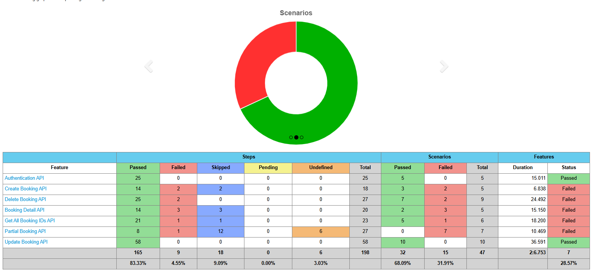
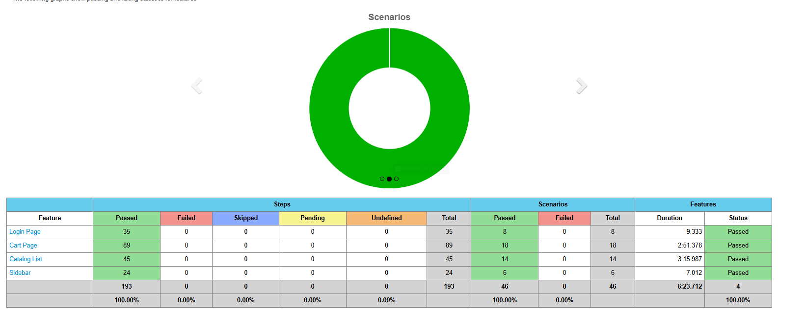
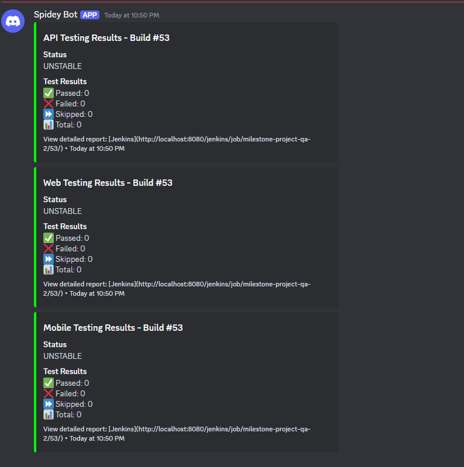

# Milestone Project Quality Assurance #2

This project implements a comprehensive test automation framework covering:

- API Testing (REST Assured)
- Web Testing (Selenium)
- Mobile Testing (Appium)
- CI/CD Pipeline (Jenkins)

---

## :house: Architecture

``` bash
├── api/                 # API Testing with REST Assured
│   ├── src/
│   │   ├── test/
│   │   │   ├── features/    # Cucumber feature files
│   │   │   ├── java/       # Step definitions & support
│   │   │   └── resources/  # Test configurations
│   └── pom.xml
├── web/                 # Web Testing with Selenium
│   ├── src/
│   │   ├── test/
│   │   │   ├── features/    # Cucumber feature files
│   │   │   ├── java/       # Step definitions & pages
│   │   │   └── resources/  # Test configurations
│   └── pom.xml
├── mobile/             # Mobile Testing with Appium
│   ├── src/
│   │   ├── test/
│   │   │   ├── features/    # Cucumber feature files
│   │   │   ├── java/       # Step definitions & pages
│   │   │   └── resources/  # Test configurations
│   └── pom.xml
├── compose.yml         # Docker composition
└── Jenkinsfile         # CI/CD Pipeline configuration
```

---

## :white_check_mark: Prerequisites

If you want to run the tests locally, you need to have Docker, Android Emulator, JDK installed and Appium installed.

- [Docker](https://www.docker.com/)
- [Android Emulator](https://developer.android.com/studio)
- [JDK](https://www.oracle.com/java/technologies/javase-jdk17-downloads.html)
- [Appium](https://appium.io/docs/en/about-appium/getting-started/)
- [Maven](https://maven.apache.org/download.cgi)

<!-- vertical line -->

---

### :muscle: Steps

#### General Steps

1. Run the docker compose by running `docker-compose up -d`
2. Open the browser and navigate to <http://localhost:8080/jenkins>
3. Login with username: `admin` and password: `admin`

#### API Testing

1. Move to the `api` folder using `cd api`
2. Run the tests using `mvn test`
3. Check the results folder `api\target\cucumber-reports`
4. If you want to show the report on the browser, open the `index.html` file
5. But if you want to run the tests on the Jenkins, you can use the `Jenkinsfile` and git push to the repository

#### Web Testing

1. Move to the `web` folder using `cd web`
2. Run the tests using `mvn test`
3. Check the results folder `web\target\cucumber-reports`
4. If you want to show the report on the browser, open the `index.html` file
5. But if you want to run the tests on the Jenkins, you can use the `Jenkinsfile` and git push to the repository

#### Mobile Testing

1. Make sure to have the Android Emulator running
2. Run appium server using `appium`
3. Move to the `mobile` folder using `cd mobile`
4. Run the tests using `mvn test`
5. Check the results folder `mobile\target\cucumber-reports`
6. If you want to show the report on the browser, open the `index.html` file
7. But if you want to run the tests on the Jenkins, you can use the `Jenkinsfile` and git push to the repository

#### CI/CD Pipeline

1. We will use the Jenkinsfile to run the tests on the Jenkins
2. But if you want to run the tests locally, you can use the `Jenkinsfile` and run `mvn test`

---

## :smile: Testing Layers

### API Testing (REST Assured)

- CRUD Operations
- Authentication flows
- Error handling scenarios
- Response validation
- Schema validation

### Web Testing (Selenium)

- User authentication
- Product catalog browsing
- Shopping cart operations
- Checkout process
- Cross-browser testing

### Mobile Testing (Appium)

- Native app functionality
- Touch interactions
- Device orientation
- App lifecycle
- Network conditions

---

## :bar_chart: Reporting

### Available Reports

- Cucumber HTML reports
- JUnit XML reports
- Jenkins pipeline reports
- Discord notifications

### Report Locations

- API: `api/target/cucumber-reports/`
- Web: `web/target/cucumber-reports/`
- Mobile: `mobile/target/cucumber-reports/`

---

## :star: Best Practices

- ✅ BDD approach with Cucumber
- ✅ Page Object Model
- ✅ Explicit waits
- ✅ Parallel execution
- ✅ Containerized testing
- ✅ CI/CD integration

### :camera: Documentation

- Rest Assured Results


- Selenium Results


- Appium Results


- Discord Notifications


